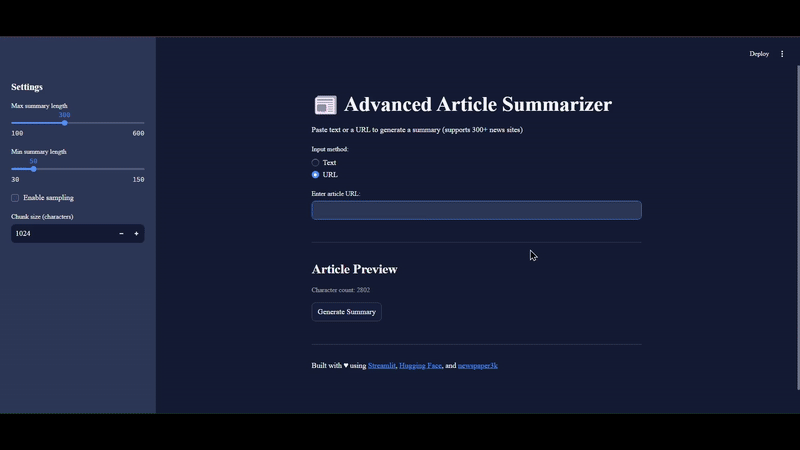

```
# Article Summarizer 📰

An AI-powered article summarizer that generates concise summaries from text or URLs using advanced NLP models. Built with Streamlit, Hugging Face Transformers, and web scraping capabilities.


---

## Features ✨
- **Dual Input Support**: Accepts both raw text and article URLs
- **Advanced NLP**: Uses Facebook's BART-large-CNN model for summarization
- **Web Scraping**: Automatic content extraction from 300+ news websites
- **Smart Fallback**: BeautifulSoup backup parser for tricky websites
- **Customizable Settings**:
  - Adjust summary length (min/max characters)
  - Enable sampling for creative summaries
  - Configure text chunking size
- **Responsive UI**: Clean interface with real-time previews

---

## Installation 🛠️

### Prerequisites
- Python 3.8+
- pip package manager
- Docker (optional, for containerized deployment)

### Steps
1. Clone the repository:
   ```bash
   git clone https://github.com/your-username/article-summarizer.git
   cd article-summarizer
   ```

2. Install dependencies:
   ```bash
   pip install -r requirements.txt
   ```

3. Download NLTK data:
   ```bash
   python -c "import nltk; nltk.download('punkt')"
   ```

---

## Usage 🚀

### Running Locally
1. Start the Streamlit app:
   ```bash
   streamlit run app.py
   ```

2. Open your browser and navigate to `http://localhost:8501`.

3. Use the app:
   - Choose input method (Text or URL)
   - Enter/paste your content
   - Adjust settings in the sidebar
   - Click "Generate Summary"

## Configuration ⚙️

### Environment Variables
Create a `.env` file for custom settings:
```ini
# Default model parameters
MAX_LENGTH=300
MIN_LENGTH=50
CHUNK_SIZE=1024
```

### Supported URL Formats
- News articles (CNN, BBC, Reuters, etc.)
- Blog posts
- Wikipedia pages
- Most text-heavy websites

---

## Contributing 🤝

1. Fork the repository.
2. Create your feature branch:
   ```bash
   git checkout -b feature/your-feature
   ```
3. Commit changes:
   ```bash
   git commit -m 'Add some feature'
   ```
4. Push to branch:
   ```bash
   git push origin feature/your-feature
   ```
5. Open a Pull Request.

---

## License 📄
MIT License - see [LICENSE](LICENSE) for details.

---

## Acknowledgments
- Built with ❤️ using:
  - [Streamlit](https://streamlit.io)
  - [Hugging Face Transformers](https://huggingface.co)
  - [Newspaper3k](https://newspaper.readthedocs.io/)
- Inspired by the need for quick and accurate article summaries.

---
